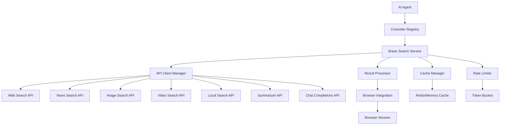

# Design Document

## Overview

The Brave Search API integration will be implemented as a comprehensive set of native tool calls within the browser-use framework. This integration will provide AI agents with direct access to Brave's search capabilities including web search, news, images, videos, local search, AI summarization, and chat completions. The design follows the existing controller/registry pattern used by browser-use and provides a robust, cached, and rate-limited search service that can work independently or in conjunction with browser automation.

## Architecture

### High-Level Architecture



### Component Integration

The integration will extend the existing browser-use architecture by:

1. **Controller Registry Extension**: Adding new action registrations for each Brave Search endpoint
2. **Service Layer**: Creating a dedicated `BraveSearchService` that manages API interactions
3. **Cache Layer**: Implementing intelligent caching with configurable TTL and LRU eviction
4. **Rate Limiting**: Respecting Brave API rate limits with proper backoff strategies
5. **Browser Integration**: Seamless integration with existing browser automation workflows

## Components and Interfaces

### 1. Brave Search Service (`browser_use/integrations/brave/service.py`)

```python
class BraveSearchService:
    """Main service for Brave Search API integration"""
    
    def __init__(self, api_key: str, cache_manager: CacheManager, rate_limiter: RateLimiter)
    
    async def web_search(self, params: BraveWebSearchParams) -> BraveWebSearchResponse
    async def news_search(self, params: BraveNewsSearchParams) -> BraveNewsSearchResponse
    async def image_search(self, params: BraveImageSearchParams) -> BraveImageSearchResponse
    async def video_search(self, params: BraveVideoSearchParams) -> BraveVideoSearchResponse
    async def local_search(self, params: BraveLocalSearchParams) -> BraveLocalSearchResponse
    async def summarizer_search(self, params: BraveSummarizerParams) -> BraveSummarizerResponse
    async def chat_completions(self, params: BraveChatParams) -> BraveChatResponse
    async def local_poi_details(self, params: BraveLocalPOIParams) -> BraveLocalPOIResponse
    async def local_descriptions(self, params: BraveLocalDescParams) -> BraveLocalDescResponse
```

### 2. API Client Manager (`browser_use/integrations/brave/client.py`)

```python
class BraveAPIClient:
    """HTTP client for Brave Search API with proper error handling"""
    
    def __init__(self, api_key: str, base_url: str = "https://api.search.brave.com")
    
    async def make_request(self, endpoint: str, params: dict, headers: dict) -> dict
    async def handle_rate_limits(self, response_headers: dict) -> None
    async def validate_response(self, response: aiohttp.ClientResponse) -> dict
```

### 3. Cache Manager (`browser_use/integrations/brave/cache.py`)

```python
class BraveCacheManager:
    """Intelligent caching for Brave Search results"""
    
    def __init__(self, ttl_seconds: int = 3600, max_size: int = 1000)
    
    async def get(self, cache_key: str) -> dict | None
    async def set(self, cache_key: str, data: dict, ttl: int | None = None) -> None
    async def invalidate(self, pattern: str) -> None
    def generate_cache_key(self, endpoint: str, params: dict) -> str
```

### 4. Rate Limiter (`browser_use/integrations/brave/rate_limiter.py`)

```python
class BraveRateLimiter:
    """Rate limiting with token bucket algorithm"""
    
    def __init__(self, requests_per_second: int = 1, requests_per_month: int = 15000)
    
    async def acquire(self) -> bool
    async def update_limits(self, rate_limit_headers: dict) -> None
    def get_remaining_quota(self) -> dict
```

### 5. Action Models (`browser_use/integrations/brave/views.py`)

```python
class BraveWebSearchAction(BaseModel):
    query: str
    country: str = "US"
    search_lang: str = "en"
    ui_lang: str = "en-US"
    count: int = 20
    offset: int = 0
    safesearch: str = "moderate"
    freshness: str | None = None
    text_decorations: bool = True
    spellcheck: bool = True
    result_filter: str | None = None
    goggles: list[str] | None = None
    units: str | None = None
    extra_snippets: bool = False
    summary: bool = False

class BraveNewsSearchAction(BaseModel):
    query: str
    country: str = "US"
    search_lang: str = "en"
    ui_lang: str = "en-US"
    count: int = 20
    offset: int = 0
    spellcheck: bool = True
    safesearch: str = "moderate"
    freshness: str | None = None
    extra_snippets: bool = False
    goggles: list[str] | None = None

class BraveImageSearchAction(BaseModel):
    query: str
    country: str = "US"
    search_lang: str = "en"
    ui_lang: str = "en-US"
    count: int = 20
    offset: int = 0
    spellcheck: bool = True
    safesearch: str = "moderate"
    freshness: str | None = None

class BraveVideoSearchAction(BaseModel):
    query: str
    country: str = "US"
    search_lang: str = "en"
    ui_lang: str = "en-US"
    count: int = 20
    offset: int = 0
    spellcheck: bool = True
    safesearch: str = "moderate"
    freshness: str | None = None

class BraveLocalSearchAction(BaseModel):
    query: str
    country: str = "US"
    search_lang: str = "en"
    ui_lang: str = "en-US"
    units: str | None = None

class BraveSummarizerSearchAction(BaseModel):
    key: str
    entity_info: bool = False
    inline_references: bool = False

class BraveChatCompletionsAction(BaseModel):
    messages: list[dict]
    model: str = "brave-pro"
    stream: bool = False
    country: str = "us"
    language: str = "en"
    enable_entities: bool = False
    enable_citations: bool = False

class BraveLocalPOIAction(BaseModel):
    ids: list[str]
    search_lang: str = "en"
    ui_lang: str = "en-US"
    units: str | None = None

class BraveLocalDescriptionsAction(BaseModel):
    ids: list[str]
    search_lang: str = "en"
    ui_lang: str = "en-US"
```

### 6. Controller Integration (`browser_use/integrations/brave/controller.py`)

```python
def register_brave_search_actions(controller: Controller, brave_service: BraveSearchService):
    """Register all Brave Search actions with the controller"""
    
    @controller.registry.action(
        "Search the web using Brave Search API for comprehensive results with rich metadata",
        param_model=BraveWebSearchAction
    )
    async def brave_web_search(params: BraveWebSearchAction) -> ActionResult:
        # Implementation
    
    @controller.registry.action(
        "Search for news articles using Brave News Search API",
        param_model=BraveNewsSearchAction
    )
    async def brave_news_search(params: BraveNewsSearchAction) -> ActionResult:
        # Implementation
    
    # Additional action registrations...
```

## Data Models

### Response Models

The integration will use Pydantic models that closely mirror the Brave API response structure:

```python
class BraveWebSearchResponse(BaseModel):
    type: str
    query: BraveQueryInfo
    web: BraveWebResults | None = None
    news: BraveNewsResults | None = None
    videos: BraveVideoResults | None = None
    images: BraveImageResults | None = None
    locations: BraveLocationResults | None = None
    infobox: BraveInfobox | None = None
    discussions: BraveDiscussions | None = None
    faq: BraveFAQ | None = None
    summarizer: BraveSummarizer | None = None
    mixed: BraveMixedResponse | None = None

class BraveSearchResult(BaseModel):
    title: str
    url: str
    description: str | None = None
    age: str | None = None
    thumbnail: BraveThumbnail | None = None
    meta_url: BraveMetaUrl | None = None
    extra_snippets: list[str] | None = None
    
class BraveNewsResult(BaseModel):
    title: str
    url: str
    description: str | None = None
    source: str | None = None
    breaking: bool = False
    age: str | None = None
    thumbnail: BraveThumbnail | None = None
    
class BraveImageResult(BaseModel):
    title: str
    url: str
    thumbnail: BraveThumbnail
    properties: BraveImageProperties | None = None
    
class BraveVideoResult(BaseModel):
    title: str
    url: str
    description: str | None = None
    video: BraveVideoData
    thumbnail: BraveThumbnail | None = None
    age: str | None = None
```

## Error Handling

### Error Types and Responses

1. **API Key Errors**: Return clear error messages and fallback to browser-based search
2. **Rate Limit Errors**: Implement exponential backoff and queue management
3. **Network Errors**: Retry with circuit breaker pattern
4. **Validation Errors**: Provide detailed parameter validation feedback
5. **Service Unavailable**: Graceful degradation to cached results or browser search

### Fallback Strategy

```python
class BraveSearchFallback:
    """Fallback strategies when Brave API is unavailable"""
    
    async def fallback_to_browser_search(self, query: str, browser_session: BrowserSession) -> ActionResult
    async def fallback_to_cached_results(self, cache_key: str) -> ActionResult | None
    async def fallback_to_alternative_search(self, query: str) -> ActionResult
```

## Testing Strategy

### Unit Tests

1. **Service Layer Tests**: Mock API responses and test business logic
2. **Cache Tests**: Verify caching behavior, TTL, and eviction policies
3. **Rate Limiter Tests**: Test token bucket algorithm and backoff strategies
4. **Model Validation Tests**: Ensure Pydantic models handle all API response variations

### Integration Tests

1. **API Integration Tests**: Test against live Brave API (with test API key)
2. **Browser Integration Tests**: Verify seamless integration with browser automation
3. **Error Handling Tests**: Test fallback mechanisms and error recovery
4. **Performance Tests**: Measure response times and cache effectiveness

### Test Structure

```python
# tests/integrations/brave/test_service.py
class TestBraveSearchService:
    async def test_web_search_success(self)
    async def test_web_search_with_cache(self)
    async def test_rate_limit_handling(self)
    async def test_api_key_validation(self)
    async def test_fallback_mechanisms(self)

# tests/integrations/brave/test_controller.py
class TestBraveSearchController:
    async def test_action_registration(self)
    async def test_parameter_validation(self)
    async def test_browser_integration(self)
    async def test_result_processing(self)
```

### Mock Data Strategy

Create comprehensive mock responses that cover:
- Successful API responses with all result types
- Error responses (rate limits, invalid keys, service errors)
- Edge cases (empty results, malformed data)
- Large response handling and truncation

## Configuration and Environment

### Environment Variables

```bash
# Required
BRAVE_SEARCH_API_KEY=your_api_key_here

# Optional Configuration
BRAVE_SEARCH_CACHE_TTL=3600          # Cache TTL in seconds
BRAVE_SEARCH_CACHE_MAX_SIZE=1000     # Maximum cache entries
BRAVE_SEARCH_RATE_LIMIT_RPS=1        # Requests per second
BRAVE_SEARCH_RATE_LIMIT_RPM=15000    # Requests per month
BRAVE_SEARCH_ENABLE_CACHE=true       # Enable/disable caching
BRAVE_SEARCH_FALLBACK_ENABLED=true   # Enable fallback to browser search
BRAVE_SEARCH_DEFAULT_COUNTRY=US      # Default country code
BRAVE_SEARCH_DEFAULT_LANGUAGE=en     # Default language
```

### Configuration Class

```python
class BraveSearchConfig:
    """Configuration management for Brave Search integration"""
    
    api_key: str
    cache_ttl: int = 3600
    cache_max_size: int = 1000
    rate_limit_rps: int = 1
    rate_limit_rpm: int = 15000
    enable_cache: bool = True
    fallback_enabled: bool = True
    default_country: str = "US"
    default_language: str = "en"
    
    @classmethod
    def from_env(cls) -> "BraveSearchConfig":
        """Load configuration from environment variables"""
```

## Performance Considerations

### Caching Strategy

1. **Cache Key Generation**: Include all relevant parameters in cache key
2. **TTL Management**: Different TTL for different content types (news: 1 hour, web: 6 hours)
3. **Cache Warming**: Pre-populate cache with common queries
4. **Memory Management**: LRU eviction with configurable size limits

### Rate Limiting

1. **Token Bucket Algorithm**: Smooth rate limiting with burst capability
2. **Adaptive Limits**: Adjust based on API response headers
3. **Queue Management**: Queue requests during rate limit periods
4. **Priority Handling**: Prioritize interactive requests over background tasks

### Response Processing

1. **Streaming Support**: Handle streaming responses for chat completions
2. **Result Truncation**: Limit response size for memory efficiency
3. **Lazy Loading**: Load additional details only when needed
4. **Parallel Processing**: Process multiple search types concurrently

## Security Considerations

### API Key Management

1. **Environment Variables**: Store API keys securely in environment
2. **Key Rotation**: Support for API key rotation without service restart
3. **Access Logging**: Log API usage without exposing sensitive data
4. **Rate Limit Monitoring**: Alert on unusual usage patterns

### Data Privacy

1. **Query Logging**: Configurable query logging with privacy controls
2. **Cache Security**: Secure cache storage with encryption at rest
3. **Response Filtering**: Filter sensitive information from responses
4. **Audit Trail**: Maintain audit logs for compliance

## Monitoring and Observability

### Metrics Collection

1. **API Metrics**: Response times, success rates, error rates
2. **Cache Metrics**: Hit rates, eviction rates, memory usage
3. **Rate Limit Metrics**: Quota usage, throttling events
4. **Business Metrics**: Search types, query patterns, user engagement

### Logging Strategy

```python
class BraveSearchLogger:
    """Structured logging for Brave Search operations"""
    
    def log_api_request(self, endpoint: str, params: dict, response_time: float)
    def log_cache_operation(self, operation: str, key: str, hit: bool)
    def log_rate_limit_event(self, remaining: int, reset_time: int)
    def log_error(self, error_type: str, details: dict)
```

### Health Checks

1. **API Connectivity**: Regular health checks to Brave API
2. **Cache Health**: Monitor cache performance and availability
3. **Rate Limit Status**: Track quota usage and remaining limits
4. **Integration Health**: Verify browser integration functionality