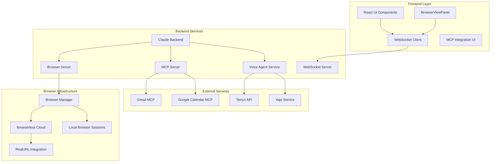

# Design Document

## Overview

This design document outlines the technical architecture for integrating browser-use with Claude AI and browserless to create a seamless browser automation experience. The system enables Claude to intelligently call browser-use endpoints as native tool calls, displays live browser sessions in an embedded UI, supports multi-tab workflows, provides human-in-the-loop control mechanisms, and integrates with external services via MCP and voice capabilities.

## Architecture

### High-Level Architecture



### Component Architecture

The system consists of several key architectural layers:

1. **Claude Integration Layer**: Handles tool calls and conversation management
2. **Browser Automation Layer**: Manages browser sessions and automation
3. **UI Integration Layer**: Provides real-time browser viewing and control
4. **External Services Layer**: Integrates MCP tools and voice capabilities
5. **Communication Layer**: WebSocket-based real-time updates

## Components and Interfaces

### 1. Claude Tool Integration

#### Enhanced Browser Tool
```python
class EnhancedBrowserTool:
    """Enhanced browser tool for Claude with full integration"""
    
    async def start_browser_session(
        self,
        instructions: str,
        conversation_id: str,
        browser_config: Optional[Dict] = None,
        mcp_tools: Optional[List[str]] = None
    ) -> Dict[str, Any]
    
    async def execute_browser_task(
        self,
        session_id: str,
        task: str,
        context: Optional[Dict] = None
    ) -> Dict[str, Any]
    
    async def request_human_intervention(
        self,
        session_id: str,
        reason: str,
        current_state: Dict[str, Any]
    ) -> Dict[str, Any]
```

#### Tool Registration
```python
CLAUDE_BROWSER_TOOLS = [
    BetaToolParam(
        name="start_browser_automation",
        description="Start a browser automation session with live UI integration",
        input_schema={
            "type": "object",
            "properties": {
                "instructions": {"type": "string"},
                "conversation_id": {"type": "string"},
                "enable_live_view": {"type": "boolean", "default": True},
                "enable_human_control": {"type": "boolean", "default": True},
                "mcp_integrations": {
                    "type": "array",
                    "items": {"type": "string"},
                    "description": "MCP tools to enable (gmail, calendar, etc.)"
                }
            },
            "required": ["instructions", "conversation_id"]
        }
    ),
    BetaToolParam(
        name="request_human_help",
        description="Request human intervention when stuck or need guidance",
        input_schema={
            "type": "object",
            "properties": {
                "session_id": {"type": "string"},
                "reason": {"type": "string"},
                "current_situation": {"type": "string"},
                "suggested_actions": {"type": "array", "items": {"type": "string"}}
            },
            "required": ["session_id", "reason", "current_situation"]
        }
    )
]
```

### 2. Enhanced Browser Manager

#### Browser Session Management
```python
class EnhancedBrowserManager:
    """Enhanced browser manager with full integration support"""
    
    def __init__(self):
        self.browserless_manager: BrowserlessManager
        self.session_registry: Dict[str, BrowserSession]
        self.conversation_sessions: Dict[str, List[str]]
        self.mcp_integrations: Dict[str, MCPIntegration]
        self.voice_agent: VoiceAgent
    
    async def create_integrated_session(
        self,
        conversation_id: str,
        browser_config: BrowserConfig,
        mcp_config: Optional[MCPConfig] = None,
        voice_config: Optional[VoiceConfig] = None
    ) -> IntegratedBrowserSession
    
    async def enable_live_url(self, session_id: str) -> str
    async def enable_multi_tab_monitoring(self, session_id: str) -> None
    async def setup_human_control_hooks(self, session_id: str) -> None
```

#### Integrated Browser Session
```python
class IntegratedBrowserSession(EnhancedBrowserSession):
    """Browser session with full integration capabilities"""
    
    def __init__(self, session_id: str, conversation_id: str):
        super().__init__(session_id)
        self.conversation_id = conversation_id
        self.live_url: Optional[str] = None
        self.mcp_tools: Dict[str, MCPTool] = {}
        self.voice_agent: Optional[VoiceAgent] = None
        self.human_control_active = False
        self.tab_monitor = TabMonitor()
    
    async def initialize_integrations(self, config: IntegrationConfig) -> None
    async def enable_mcp_tool(self, tool_name: str, config: Dict) -> None
    async def enable_voice_capabilities(self, voice_config: VoiceConfig) -> None
    async def request_human_intervention(self, reason: str) -> HumanControlSession
```

### 3. Real-Time UI Integration

#### Enhanced BrowserViewPanel
```typescript
interface EnhancedBrowserViewPanelProps {
  sessions: IntegratedBrowserSession[];
  onHumanControlRequest: (sessionId: string, action: ControlAction) => void;
  onVoiceCommand: (command: string) => void;
  mcpIntegrations: MCPIntegration[];
}

class EnhancedBrowserViewPanel extends React.Component {
  private wsConnection: WebSocket;
  private voiceRecognition: VoiceRecognition;
  private tabMonitor: TabMonitor;
  
  async handleControlTransition(sessionId: string, takeControl: boolean): Promise<void>
  async sendVoiceCommand(command: string): Promise<void>
  async executeMCPAction(tool: string, action: string, params: any): Promise<void>
}
```

#### Multi-Tab Monitoring
```typescript
class TabMonitor {
  private activeTabs: Map<string, TabInfo> = new Map();
  private tabSubscriptions: Map<string, WebSocket> = new Map();
  
  async monitorSession(sessionId: string): Promise<void>
  async switchTab(sessionId: string, tabId: string): Promise<void>
  async getTabStates(sessionId: string): Promise<TabInfo[]>
  
  private async handleTabChange(sessionId: string, tabInfo: TabInfo): Promise<void>
  private async broadcastTabUpdate(sessionId: string, tabs: TabInfo[]): Promise<void>
}
```

### 4. Human-in-the-Loop Control System

#### Control State Management
```python
class HumanControlManager:
    """Manages human-in-the-loop control transitions"""
    
    def __init__(self):
        self.active_controls: Dict[str, HumanControlSession] = {}
        self.control_history: Dict[str, List[ControlEvent]] = {}
    
    async def request_human_control(
        self,
        session_id: str,
        reason: str,
        agent_state: Dict[str, Any]
    ) -> HumanControlSession
    
    async def transfer_control_to_human(
        self,
        session_id: str,
        message: str
    ) -> ControlTransferResult
    
    async def return_control_to_agent(
        self,
        session_id: str,
        human_actions_summary: str,
        context_update: Dict[str, Any]
    ) -> ControlTransferResult
```

#### Control Session
```python
@dataclass
class HumanControlSession:
    session_id: str
    conversation_id: str
    start_time: datetime
    reason: str
    agent_state_snapshot: Dict[str, Any]
    human_actions: List[HumanAction]
    status: ControlStatus
    
    async def log_human_action(self, action: HumanAction) -> None
    async def generate_summary(self) -> str
    async def create_agent_context_update(self) -> Dict[str, Any]
```

### 5. MCP Integration System

#### MCP Service Manager
```python
class MCPServiceManager:
    """Manages MCP tool integrations"""
    
    def __init__(self):
        self.registered_tools: Dict[str, MCPTool] = {}
        self.active_sessions: Dict[str, Dict[str, MCPSession]] = {}
    
    async def register_mcp_tool(self, tool_config: MCPToolConfig) -> None
    async def enable_for_session(self, session_id: str, tool_name: str) -> MCPSession
    async def execute_mcp_action(self, session_id: str, tool_name: str, action: str, params: Dict) -> Any
```

#### Gmail MCP Integration
```python
class GmailMCPTool(MCPTool):
    """Gmail integration via MCP"""
    
    async def authenticate(self, credentials: Dict[str, str]) -> bool
    async def read_emails(self, query: str, limit: int = 10) -> List[Email]
    async def send_email(self, to: str, subject: str, body: str) -> bool
    async def search_emails(self, criteria: SearchCriteria) -> List[Email]
    
    # Browser automation integration
    async def open_gmail_in_browser(self, session_id: str) -> None
    async def compose_email_in_browser(self, session_id: str, email_data: EmailData) -> None
```

#### Google Calendar MCP Integration
```python
class GoogleCalendarMCPTool(MCPTool):
    """Google Calendar integration via MCP"""
    
    async def authenticate(self, credentials: Dict[str, str]) -> bool
    async def get_events(self, start_date: datetime, end_date: datetime) -> List[CalendarEvent]
    async def create_event(self, event: CalendarEvent) -> str
    async def update_event(self, event_id: str, updates: Dict[str, Any]) -> bool
    
    # Browser automation integration
    async def open_calendar_in_browser(self, session_id: str) -> None
    async def create_event_in_browser(self, session_id: str, event_data: CalendarEvent) -> None
```

### 6. Voice Agent Integration

#### Voice Agent Service
```python
class VoiceAgentService:
    """Voice capabilities via Telnyx/Vapi integration"""
    
    def __init__(self):
        self.telnyx_client: TelnyxClient
        self.vapi_client: VapiClient
        self.active_calls: Dict[str, VoiceCall] = {}
        self.speech_recognition: SpeechRecognition
        self.text_to_speech: TextToSpeech
    
    async def start_voice_session(self, session_id: str, config: VoiceConfig) -> VoiceSession
    async def process_voice_command(self, session_id: str, audio_data: bytes) -> VoiceCommand
    async def provide_voice_feedback(self, session_id: str, message: str) -> None
    async def initiate_phone_call(self, phone_number: str, purpose: str) -> VoiceCall
```

#### Voice Command Processing
```python
class VoiceCommandProcessor:
    """Processes voice commands for browser automation"""
    
    async def parse_voice_command(self, audio_data: bytes) -> ParsedCommand
    async def execute_browser_command(self, session_id: str, command: ParsedCommand) -> CommandResult
    async def handle_control_request(self, session_id: str, voice_request: str) -> ControlAction
    
    # Command types
    async def handle_navigation_command(self, session_id: str, url: str) -> None
    async def handle_interaction_command(self, session_id: str, action: str, target: str) -> None
    async def handle_control_command(self, session_id: str, control_type: str) -> None
```

### 7. WebSocket Communication Layer

#### Enhanced WebSocket Manager
```python
class EnhancedWebSocketManager:
    """Enhanced WebSocket manager for real-time communication"""
    
    def __init__(self):
        self.connections: Dict[str, WebSocket] = {}
        self.session_subscribers: Dict[str, Set[str]] = {}
        self.voice_subscribers: Set[str] = set()
        self.mcp_subscribers: Dict[str, Set[str]] = {}
    
    async def broadcast_browser_update(self, session_id: str, update: BrowserUpdate) -> None
    async def broadcast_control_change(self, session_id: str, control_event: ControlEvent) -> None
    async def broadcast_voice_event(self, voice_event: VoiceEvent) -> None
    async def broadcast_mcp_event(self, tool_name: str, event: MCPEvent) -> None
```

## Data Models

### Core Models

```python
@dataclass
class IntegratedBrowserSession:
    session_id: str
    conversation_id: str
    browser_url: Optional[str]
    live_url: Optional[str]
    current_url: str
    current_title: str
    screenshot: Optional[bytes]
    tabs: List[TabInfo]
    human_control_active: bool
    mcp_tools_enabled: List[str]
    voice_enabled: bool
    created_at: datetime
    last_activity: datetime

@dataclass
class TabInfo:
    tab_id: str
    url: str
    title: str
    is_active: bool
    screenshot: Optional[bytes]
    last_update: datetime

@dataclass
class ControlEvent:
    session_id: str
    event_type: ControlEventType
    timestamp: datetime
    user_id: Optional[str]
    message: str
    context: Dict[str, Any]

@dataclass
class VoiceCommand:
    session_id: str
    command_text: str
    confidence: float
    intent: CommandIntent
    parameters: Dict[str, Any]
    timestamp: datetime

@dataclass
class MCPEvent:
    tool_name: str
    session_id: str
    action: str
    parameters: Dict[str, Any]
    result: Any
    timestamp: datetime
```

### Configuration Models

```python
@dataclass
class IntegrationConfig:
    browser_config: BrowserConfig
    mcp_config: Optional[MCPConfig]
    voice_config: Optional[VoiceConfig]
    ui_config: UIConfig

@dataclass
class MCPConfig:
    enabled_tools: List[str]
    gmail_credentials: Optional[Dict[str, str]]
    calendar_credentials: Optional[Dict[str, str]]
    auto_authenticate: bool = True

@dataclass
class VoiceConfig:
    provider: str  # 'telnyx' or 'vapi'
    language: str = 'en-US'
    enable_phone_calls: bool = False
    phone_number: Optional[str] = None
    voice_commands_enabled: bool = True
    audio_feedback_enabled: bool = True
```

## Error Handling

### Error Recovery Strategies

1. **Browser Session Failures**
   - Automatic session recreation with state preservation
   - Fallback to local browser if Browserless fails
   - Screenshot-based recovery for UI state

2. **WebSocket Connection Issues**
   - Automatic reconnection with exponential backoff
   - Message queuing during disconnection
   - State synchronization on reconnection

3. **MCP Tool Failures**
   - Graceful degradation to browser-only mode
   - Credential refresh and re-authentication
   - Alternative tool suggestions

4. **Voice Service Failures**
   - Fallback to text-based interaction
   - Audio quality degradation handling
   - Network interruption recovery

### Error Monitoring

```python
class IntegrationErrorHandler:
    """Centralized error handling for all integrations"""
    
    async def handle_browser_error(self, session_id: str, error: BrowserError) -> RecoveryAction
    async def handle_mcp_error(self, tool_name: str, error: MCPError) -> RecoveryAction
    async def handle_voice_error(self, session_id: str, error: VoiceError) -> RecoveryAction
    async def handle_websocket_error(self, connection_id: str, error: WebSocketError) -> RecoveryAction
    
    async def log_error(self, error: IntegrationError) -> None
    async def notify_user(self, session_id: str, error_summary: str) -> None
```

## Testing Strategy

### Unit Testing
- Individual component testing for each integration layer
- Mock services for external dependencies (Browserless, Telnyx, Vapi)
- WebSocket communication testing with mock clients

### Integration Testing
- End-to-end browser automation workflows
- Human control transition scenarios
- MCP tool integration testing
- Voice command processing validation

### Performance Testing
- WebSocket message throughput testing
- Browser session scalability testing
- Real-time screenshot streaming performance
- Multi-tab monitoring efficiency

### User Acceptance Testing
- Human-in-the-loop workflow validation
- Voice command accuracy testing
- UI responsiveness under load
- Cross-browser compatibility testing

## Security Considerations

### Authentication & Authorization
- Secure MCP credential storage and rotation
- Session-based access control for browser sessions
- Voice command authentication for sensitive actions

### Data Protection
- Encrypted WebSocket communications
- Secure screenshot transmission
- PII detection and masking in voice transcripts

### Network Security
- HTTPS enforcement for all external communications
- Browserless connection security validation
- Voice service encryption requirements

## Deployment Architecture

### Development Environment
```yaml
services:
  claude-backend:
    build: .
    ports: ["8001:8001"]
    environment:
      - ANTHROPIC_API_KEY
      - BROWSERLESS_API_KEY
      - TELNYX_API_KEY
      - VAPI_API_KEY
  
  browser-server:
    build: .
    ports: ["8000:8000"]
    depends_on: [claude-backend]
  
  frontend:
    build: .
    ports: ["3000:3000"]
    depends_on: [browser-server, claude-backend]
```

### Production Considerations
- Load balancing for multiple browser sessions
- Redis for session state management
- Monitoring and alerting for all integrations
- Backup strategies for conversation data